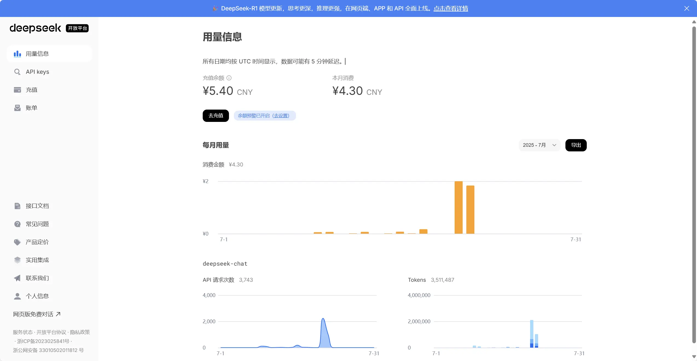

# 第二节 准备工作

## 一、Deepseek API配置

### 1.1 API申请

要使用 Deepseek 提供的大语言模型服务，你首先需要一个 API Key。下面是申请步骤：

1.  **访问 Deepseek 开放平台**
    打开浏览器，访问 [Deepseek 开放平台](https://platform.deepseek.com/)。

    

2.  **登录或注册账号**
    如果你已有账号，请直接登录。如果没有，请点击页面上的注册按钮，使用邮箱或手机号完成注册。

3.  **创建新的 API 密钥**
    登录成功后，在页面左侧的导航栏中找到并点击 `API Keys`。在 API 管理页面，点击 `创建 API key` 按钮。输入一个跟其他api key不重复的名称后点击创建

    

4.  **保存 API Key**
    系统会为你生成一个新的 API 密钥。请**立即复制**并将其保存在一个安全的地方。

    > 注意：出于安全原因，这个密钥只会完整显示一次，关闭弹窗后就没法再看到了。

    

### 1.2 API配置

#### 1.2.1 Windows 配置

1.  右键点击 “计算机” 或 “此电脑”，然后点击 “属性”。

2.  在左侧菜单中，点击 “高级系统设置”。

3.  在 “系统属性” 对话框中，点击 “高级” 选项卡，然后点击下方的 “环境变量” 按钮。

    

4.  在 “环境变量” 对话框中，点击 “新建”（在 “用户变量” 部分下），然后输入以下信息：
    - 变量名：DEEPSEEK_API_KEY
    - 变量值：[你的 Deepseek API 密钥]

    

#### 1.2.2 macOS / Linux 配置

在 macOS 或 Linux 系统中，我们推荐将 API 密钥添加到 shell 的配置文件中，使其成为永久环境变量。

1.  **打开终端**。

2.  **编辑 Shell 配置文件**
    使用 `vim` 编辑器打开你的 shell 配置文件。如果你使用的是 Bash (多数 Linux 发行版的默认 shell)，命令如下：
    ```bash
    vim ~/.bashrc
    ```
    如果你使用的是 Zsh (macOS 的默认 shell)，命令如下：
    ```bash
    vim ~/.zshrc
    ```

3.  **添加环境变量**
    在文件末尾添加以下行，将 `[你的 Deepseek API 密钥]` 替换为你自己的密钥：
    ```bash
    export DEEPSEEK_API_KEY="[你的 Deepseek API 密钥]"
    ```

4.  **保存并退出**
    在 `vim` 中，按 `Esc` 键进入命令模式，然后输入 `:wq` 并按 `Enter` 键保存文件并退出。

5.  **使配置生效**
    执行以下命令来立即加载更新后的配置，让环境变量生效：
    *   对于 Bash:
        ```bash
        source ~/.bashrc
        ```
    *   对于 Zsh:
        ```bash
        source ~/.zshrc
        ```
    现在，你可以在任何新的终端会话中访问这个环境变量了。

## 二、Miniconda 安装（由于笔者用的是Anaconda怕安装Miniconda出现环境问题，所以下面流程暂未测试😅）

Conda 是一个开源的包管理系统和环境管理系统，用于安装多个版本的软件包及其依赖关系，并在它们之间轻松切换。Miniconda 是 Conda 的一个免费的最小安装程序。它是 Anaconda 的一个轻量级替代品，只包含了 Conda、Python、它们所依赖的包以及少量其他有用的包。

对于希望快速访问 Conda 命令和不想安装 Anaconda 发行版中包含的 1,500 多个包的用户来说，Miniconda 是一个理想的选择。

### 2.1 Windows 环境安装

1.  **下载安装程序**

    优先推荐访问[清华大学开源软件镜像站](https://mirrors.tuna.tsinghua.edu.cn/anaconda/miniconda/)，以获得更快的下载速度。根据你的系统选择最新的 `Windows-x86_64.exe` 版本下载。

    

    你也可以从 [Miniconda 官方网站](https://docs.conda.io/en/latest/miniconda.html)下载。

2.  **运行安装向导**

    下载完成后，双击 `.exe` 文件启动安装。按照向导提示操作：

    *   **Welcome**: 点击 `Next`。
        
    *   **License Agreement**: 点击 `I Agree`。
        
    *   **Installation Type**: 选择 `Just Me`，点击 `Next`。
        
    *   **Choose Install Location**: 建议保持默认路径，或选择一个不含中文和空格的路径。点击 `Next`。
        
    *   **Advanced Installation Options**: **请不要勾选** “Add Miniconda3 to my PATH environment variable”。我们将稍后手动配置环境变量。点击 `Install`。
        
    *   **Installation Complete**: 安装完成后，点击 `Next`，然后取消勾选 “Learn more” 并点击 `Finish` 完成安装。
        

3.  **手动配置环境变量**

    为了能在任意终端窗口使用 `conda` 命令，需要手动配置环境变量。

    *   在Windows搜索栏中搜索“编辑系统环境变量”并打开。
        
    *   在“系统属性”窗口中，点击“环境变量”。
        
    *   在“环境变量”窗口中，找到“系统变量”下的 `Path` 变量，选中并点击“编辑”。
        
    *   在“编辑环境变量”窗口中，新建三个路径，将它们指向你 Miniconda 的安装目录下的相应文件夹。如果你的安装路径是 `D:\Miniconda3`，则需要添加：
        ```
        D:\Miniconda3
        D:\Miniconda3\Scripts
        D:\Miniconda3\Library\bin
        ```
        
    *   完成后，一路点击“确定”保存更改。

### 2.2 Linux 环境安装

1.  **下载安装脚本**
    打开终端，使用 `wget` 下载最新的 Miniconda 安装脚本。优先推荐从[清华大学开源软件镜像站](https://mirrors.tuna.tsinghua.edu.cn/anaconda/miniconda/)获取链接。

    ```bash
    wget https://repo.anaconda.com/miniconda/Miniconda3-latest-Linux-x86_64.sh
    ```

2.  **运行安装脚本**
    下载完成后，在终端中运行以下命令启动安装：
    ```bash
    bash Miniconda3-latest-Linux-x86_64.sh
    ```
    *   **许可协议**: 按 `Enter` 查看许可协议，然后输入 `yes` 同意。
    *   **安装路径**: 按 `Enter` 确认默认安装路径，或指定一个新路径。
    *   **初始化 Conda**: 当询问是否要通过运行 `conda init` 来初始化 Miniconda3 时，输入 `yes`。

3.  **激活更改**
    安装程序会自动修改你的 shell 配置文件 (如 `.bashrc`)。为了使更改生效，请关闭并重新打开你的终端，或者运行以下命令：
    ```bash
    source ~/.bashrc
    ```

### 2.3 配置 Conda 镜像源

为了加快后续使用 `conda` 安装包的速度，强烈建议配置国内镜像源。打开一个新的终端或 Anaconda Prompt，运行以下命令：

```bash
conda config --add channels https://mirrors.tuna.tsinghua.edu.cn/anaconda/pkgs/main/
conda config --add channels https://mirrors.tuna.tsinghua.edu.cn/anaconda/pkgs/free/
conda config --set show_channel_urls yes
```

配置完成后，可以通过 `conda config --show channels` 命令查看已添加的源。

### 2.4 验证安装

打开一个新的终端或 Anaconda Prompt，进行以下验证：

1.  **检查 Conda 版本**:
    ```bash
    conda --version
    ```
    如果成功，将显示 Conda 的版本号。

2.  **创建环境**:
    尝试创建一个新的虚拟环境，检验镜像源是否配置成功。
    ```bash
    conda create --name rag python=3.12.7
    ```
    如果命令成功执行并提示安装包信息，则说明 Miniconda 已安装并配置正确。


