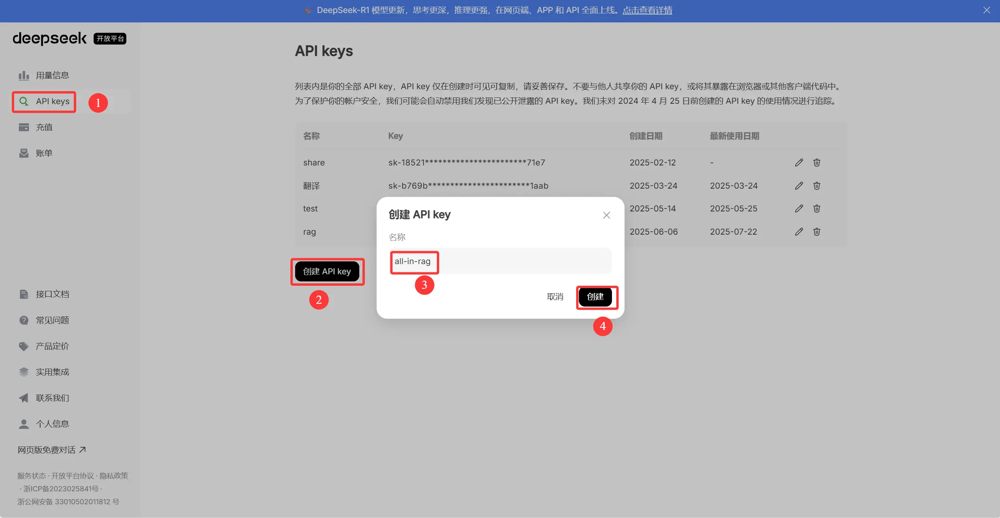
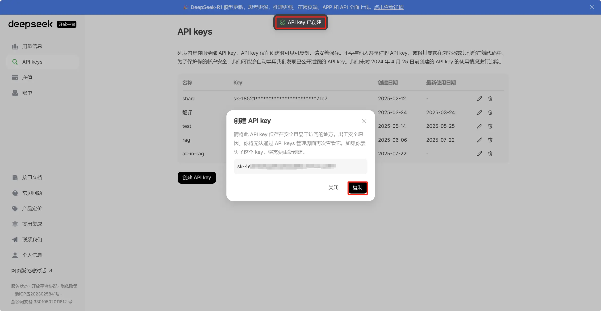
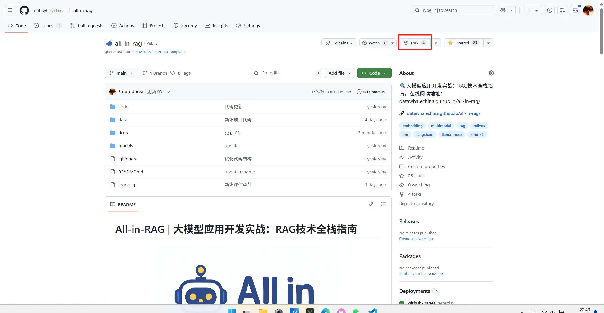
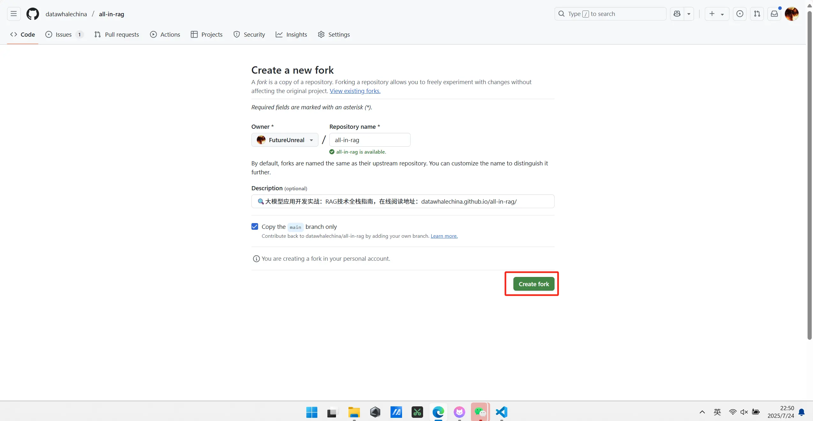
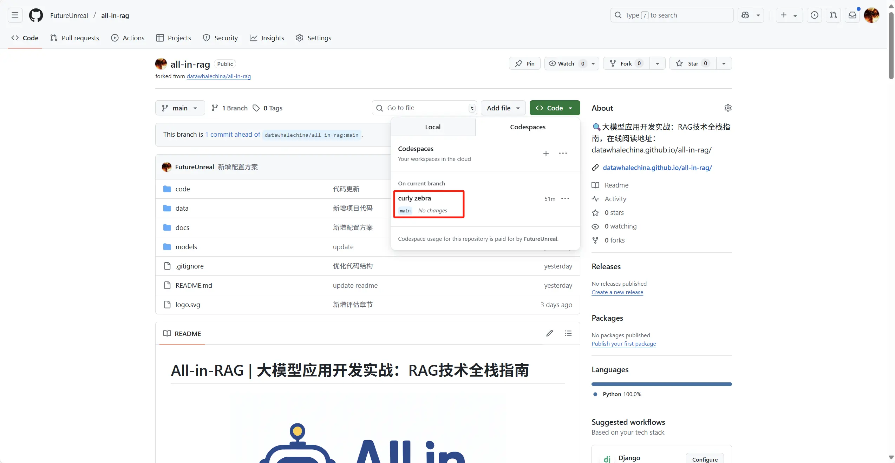
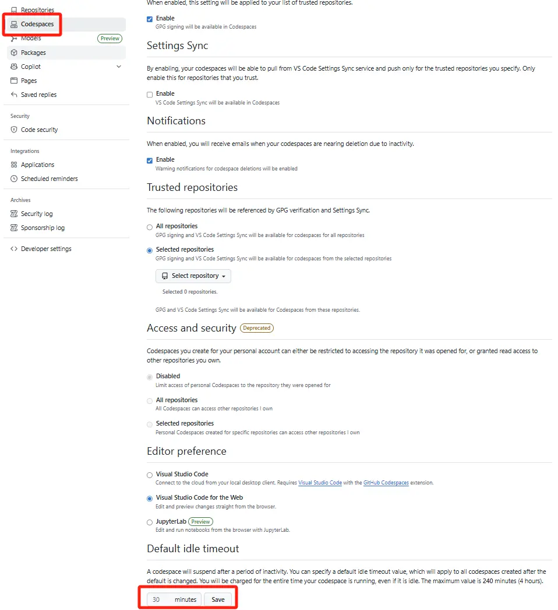

# 第二节 准备工作

## 一、Deepseek API配置

### 1.1 API申请

要使用 Deepseek 提供的大语言模型服务，你首先需要一个 API Key。下面是申请步骤：

1.  **访问 Deepseek 开放平台**
    打开浏览器，访问 [Deepseek 开放平台](https://platform.deepseek.com/)。

    

2.  **登录或注册账号**
    如果你已有账号，请直接登录。如果没有，请点击页面上的注册按钮，使用邮箱或手机号完成注册。

3.  **创建新的 API 密钥**
    登录成功后，在页面左侧的导航栏中找到并点击 `API Keys`。在 API 管理页面，点击 `创建 API key` 按钮。输入一个跟其他api key不重复的名称后点击创建

    

4.  **保存 API Key**
    系统会为你生成一个新的 API 密钥。请**立即复制**并将其保存在一个安全的地方。

    > 注意：出于安全原因，这个密钥只会完整显示一次，关闭弹窗后就没法再看到了。

    

## 二、Cloud Studio 环境配置（推荐）

Cloud Studio 是腾讯云推出的一款基于浏览器的集成开发环境（IDE）。支持CPU与GPU的访问。

> 听说一个月是50个小时的免费额度🤔

### 2.1 应用创建

1.  **访问 Cloud Studio**
    打开浏览器，访问 [Cloud Studio](https://studio.cloud.tencent.com/)。

2.  **登录或注册账号**
    点击页面右上角的 `注册登录` 按钮，使用微信等方式完成登录。

3.  **创建应用**
    在页面上方的导航栏中找到并点击 `创建应用`。选择 `从 Git 仓库导入` ，在项目地址栏输入 `https://github.com/datawhalechina/all-in-rag.git` 后回车，将会自动为你创建标题和描述。

    

4.  **再次进入**
    后续在[应用管理页面](https://cloudstudio.net/my-app)找到之前创建的应用，点击后选择右上角编写代码即可再次进入。

    

### 2.2 python环境配置

进入 IDE 后先选择右侧终端


1.  **更新系统软件包**

    ```bash
    sudo apt update
    sudo apt upgrade -y
    ```

2.  **切换普通用户**

    ```bash
    su ubuntu
    ```

3.  **安装Miniconda**

    ```bash
    wget https://repo.anaconda.com/miniconda/Miniconda3-latest-Linux-x86_64.sh -O ~/miniconda.sh
    bash ~/miniconda.sh
    ```

    - 按 Enter 阅读许可协议
    - 输入 `yes` 同意协议
    - 安装路径提示时直接按 Enter（使用默认路径 /home/ubuntu/miniconda3）
    - 是否初始化Miniconda：输入 `yes` 将Miniconda添加到您的PATH环境变量中。

    ```bash
    source ~/.bashrc
    conda --version
    ```

    如果显示版本号，说明安装成功。

### 2.3 API配置

1.  使用 `vim` 编辑器打开你的 shell 配置文件。

    ```bash
    vim ~/.bashrc
    ```

2.  输入 `i` 进入编辑模式，在文件末尾添加以下行，将 `[你的 Deepseek API 密钥]` 替换为你自己的密钥：

    ```bash
    export DEEPSEEK_API_KEY=[你的 Deepseek API 密钥]
    ```

3.  保存并退出 在 vim 中，按 Esc 键进入命令模式，然后输入 `:wq` 并按 Enter 键保存文件并退出。

4.  使配置生效 执行以下命令来立即加载更新后的配置，让环境变量生效：

    ```bash
    source ~/.bashrc
    ```

### 2.4 创建并激活虚拟环境

1.  **创建虚拟环境**

   ```bash
   conda create --name rag python=3.12.7
   ```

   出现选项直接回车即可。

2.  **配置文件权限**

   ```bash
   sudo chown -R ubuntu:ubuntu code models
   ```

3.  **激活虚拟环境**

   使用以下命令激活虚拟环境：

   ```bash
   conda activate rag
   ```

4.  **依赖安装**
    如果严格安装上述流程当前应该在项目根目录，进入code目录安装依赖库

    ```bash
   cd code
   pip install -r requirements.txt
   ```

## 三、windows环境配置

### 3.1 API配置

1.  右键点击 “计算机” 或 “此电脑”，然后点击 “属性”。

2.  在左侧菜单中，点击 “高级系统设置”。

3.  在 “系统属性” 对话框中，点击 “高级” 选项卡，然后点击下方的 “环境变量” 按钮。

    

4.  在 “环境变量” 对话框中，点击 “新建”（在 “用户变量” 部分下），然后输入以下信息：
    - 变量名：DEEPSEEK_API_KEY
    - 变量值：[你的 Deepseek API 密钥]

    

### 3.2 安装Miniconda

1.  **下载安装程序**

    优先推荐访问[清华大学开源软件镜像站](https://mirrors.tuna.tsinghua.edu.cn/anaconda/miniconda/)，以获得更快的下载速度。根据你的系统选择最新的 `Windows-x86_64.exe` 版本下载。

    

    你也可以从 [Miniconda 官方网站](https://docs.conda.io/en/latest/miniconda.html)下载。

2.  **运行安装向导**

    下载完成后，双击 `.exe` 文件启动安装。按照向导提示操作：

    *   **Welcome**: 点击 `Next`。
        
    *   **License Agreement**: 点击 `I Agree`。
        
    *   **Installation Type**: 选择 `Just Me`，点击 `Next`。
        
    *   **Choose Install Location**: 建议保持默认路径，或选择一个不含中文和空格的路径。点击 `Next`。
        
    *   **Advanced Installation Options**: **请不要勾选** “Add Miniconda3 to my PATH environment variable”。我们将稍后手动配置环境变量。点击 `Install`。
        
    *   **Installation Complete**: 安装完成后，点击 `Next`，然后取消勾选 “Learn more” 并点击 `Finish` 完成安装。
        

3.  **手动配置环境变量**

    为了能在任意终端窗口使用 `conda` 命令，需要手动配置环境变量。

    *   在Windows搜索栏中搜索“编辑系统环境变量”并打开。
        
    *   在“系统属性”窗口中，点击“环境变量”。
        
    *   在“环境变量”窗口中，找到“系统变量”下的 `Path` 变量，选中并点击“编辑”。
        
    *   在“编辑环境变量”窗口中，新建三个路径，将它们指向你 Miniconda 的安装目录下的相应文件夹。如果你的安装路径是 `D:\Miniconda3`，则需要添加：
        ```
        D:\Miniconda3
        D:\Miniconda3\Scripts
        D:\Miniconda3\Library\bin
        ```
        
    *   完成后，一路点击“确定”保存更改。

### 3.3 配置 Conda 镜像源

为了加快后续使用 `conda` 安装包的速度，强烈建议配置国内镜像源。打开一个新的终端或 Anaconda Prompt，运行以下命令：

```bash
conda config --add channels https://mirrors.tuna.tsinghua.edu.cn/anaconda/pkgs/main/
conda config --add channels https://mirrors.tuna.tsinghua.edu.cn/anaconda/pkgs/free/
conda config --set show_channel_urls yes
```

配置完成后，可以通过 `conda config --show channels` 命令查看已添加的源。

## 三、项目代码拉取（使用Cloud Studio可跳过此步骤）

### 3.1 安装 Git

如果你尚未安装 Git，请按照以下步骤安装。

* **Windows 系统**：访问[Git 官方网站](https://git-scm.com/download/win)，下载并运行安装程序，按照默认设置完成安装。
* **macOS 系统**：打开终端，输入以下命令安装 Git：

  ```bash
  brew install git
  ```
* **Linux 系统（以 Ubuntu 为例）**：打开终端，输入以下命令安装 Git：

  ```bash
  sudo apt-get update
  sudo apt-get install git
  ```

安装完成后，验证 Git 是否安装成功，输入以下命令：

```bash
git --version
```

如果成功，会显示 Git 的版本号。

### 3.2 克隆项目代码

1. **选择存放项目的目录**
   打开终端（或 Windows 中的 Git Bash），导航到你想存放项目的目录：

   ```bash
   cd [你希望存放项目的路径]
   ```

2. **克隆仓库**
   使用以下命令拉取 `all-in-rag` 仓库：

   ```bash
   git clone https://github.com/datawhalechina/all-in-rag.git
   ```

   等待下载完成，项目代码将存放在当前目录下的 `all-in-rag` 文件夹中。

3. **进入项目目录**
   拉取代码后，进入项目目录：

   ```bash
   cd all-in-rag
   ```

### 3.3 创建并激活虚拟环境

在项目目录下，推荐使用前面配置好的 Miniconda 来创建 Python 虚拟环境。

1. **创建虚拟环境**

   ```bash
   conda create --name rag python=3.12.7
   ```

2. **激活虚拟环境**

   所有系统统一使用以下命令激活虚拟环境：

   ```bash
   conda activate rag
   ```
