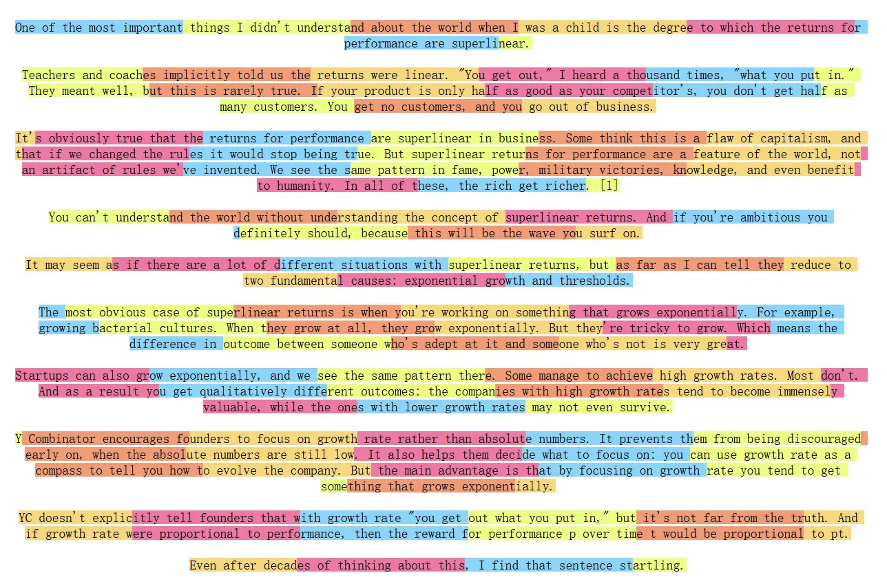

# 第二节 文本分块

## 一、什么是文本分块

文本分块（Text Chunking）是构建RAG流程的关键步骤。它的核心原理是将加载后的长篇文档，切分成更小、更易于处理的单元。这些被切分出的文本块，是后续向量检索和模型处理的**基本单位**。

## 二、为何需要文本分块

将长文本分解为适当大小的片段，主要基于两大考量：模型的**上下文限制**和检索生成的**性能需求**。

### 2.1 满足模型上下文限制

无论是用于生成嵌入向量的**嵌入模型**，还是用于生成答案的**大语言模型 (LLM)**，它们都有一个最大的上下文窗口（Context Window），即它们一次能够处理的 token 数量上限。

### 2.2 提升检索与生成质量

假设嵌入模型最多能处理8192个token，我们是否应该把块切得尽可能大（比如8000个token）呢？答案是否定的。**块的大小并非越大越好**，过大的块会严重影响RAG系统的性能。

#### 2.2.1 嵌入过程的“信息损失”

大多数嵌入模型都基于 Transformer 编码器。其工作流程大致如下：

1.  **分词 (Tokenization)**: 将输入的文本块分解成一个个 token。
2.  **向量化 (Vectorization)**: Transformer 为**每个 token** 生成一个高维向量表示。
3.  **池化 (Pooling)**: 通过某种策略（如取`[CLS]`位的向量、对所有token向量求平均`mean pooling`等），将所有 token 的向量**压缩**成一个**单一的向量**，这个向量代表了整个文本块的语义。

在这个“压缩”过程中，信息损失是不可避免的。一个768维的向量需要概括整个文本块的所有信息。**文本块越长，包含的语义点越多，这个单一向量所承载的信息就越“稀释”**，导致其表示变得笼统，关键细节被模糊化，从而降低了检索的精度。

#### 2.2.2 生成过程的“大海捞针” (Lost in the Middle)

即使我们将检索到的多个大块文本都塞进LLM的长上下文窗口中，也会出现“大海捞针”的问题。研究表明，当LLM处理非常长的、充满大量信息的上下文时，它倾向于更好地记住开头和结尾的信息，而忽略中间部分的内容。

如果提供给LLM的上下文块又大又杂，充满了与问题无关的“噪音”，模型就很难从中提取出最关键的信息来形成答案，从而导致回答质量下降或产生幻觉。

#### 2.2.3 主题稀释导致检索失败

一个好的文本块应该聚焦于一个明确、单一的主题。如果一个块包含太多不相关的主题，它的语义就会被“稀释”，导致在检索时无法被精确匹配。

**举个栗子🌰：**

假设我们有一个关于《王者荣耀》英雄`鲁班七号`的攻略文档。

- **糟糕的分块策略**：将“技能介绍”、“推荐出装”和“背景故事”这三个完全不同主题的内容，全部放在一个巨大的文本块里。
    - 当玩家查询“鲁班七号怎么出装？”时，这个大块虽然包含了出装信息，但由于被技能说明和英雄故事等无关主题严重稀释，其整体的检索相关性得分可能会很低，导致无法被召回。

- **优秀的分块策略**：将“技能”、“出装”和“故事”分别切分为三个独立的、主题聚焦的块。
    - 当玩家再次查询时，“推荐出装”这个块会因为与查询高度相关而获得极高的分数，从而被精准地检索出来。

通过合理分块，可以有效提升检索的信噪比，确保了后续生成环节能得到最优质、最相关的上下文。

## 三、主流分块策略

LangChain 提供了丰富且易于使用的文本分割器（Text Splitters），下面我们介绍几种最核心的策略及其代码实现。

### 3.1 固定大小分块

这是最简单直接的方法，按照预设的字符数（`chunk_size`）进行硬切分，并可以通过`chunk_overlap`参数设置块之间的重叠部分，以保留部分上下文。

- **实现原理**: 从文本开头按`chunk_size`计数，达到数量就切一刀。
- **代表工具**: `langchain.text_splitter.CharacterTextSplitter`
- **优势**: 简单、快速、计算开销小。
- **劣势**: **严重破坏语义完整性**。极有可能在句子中间、单词中间切断，导致上下文丢失，是**最不推荐**但在某些简单场景下可用的方法。

### 3.2 递归字符分块

这是 **LangChain 中最推荐、最通用的默认方法**。它尝试按一组预定义的、有层次结构的分隔符（如段落、句子、单词）进行递归分割，以最大程度地保留文本的语义结构。

- **实现原理**: 优先使用最高级别的分隔符（如`\n\n`）进行分割。如果分割后的块仍然大于`chunk_size`，则在该块上使用次一级的分隔符（如`\n`）继续分割，以此类推，直到所有块都小于`chunk_size`。
- **代表工具**: `langchain.text_splitter.RecursiveCharacterTextSplitter`
- **优势**: 尽最大努力保持段落、句子的完整性，是语义保留和实现简单性之间的最佳平衡。
- **劣势**: 效果依赖于文本自身的格式是否规范。

### 3.3 基于文档结构的分块

对于具有明确结构标记的文档格式（如Markdown、HTML、LaTex），我们可以利用这些标记来实现更智能、更符合逻辑的分割。

#### Markdown 结构分块

- **实现原理**: 根据Markdown的标题（`#`、`##`等）来分割文档，可以将一个章节或小节作为一个完整的块。
- **代表工具**: `langchain.text_splitter.MarkdownHeaderTextSplitter`
- **优势**: 完美保留文档的逻辑层次结构，语义内聚性极高。每个块都与一个特定的标题相关联，非常适合问答。
- **劣势**: 只适用于格式良好的Markdown文档。

## 四、高级分块策略

当基础策略无法满足复杂需求时，可以考虑以下更高级的技巧。

### 4.1 语义分块

- **实现原理**: 不依赖于固定大小或特定字符，而是使用语言模型来分析句子之间的语义相似性。当相邻句子之间的语义差异超过某个阈值时，就进行切分。
- **优势**: 能最精准地捕捉语义边界，生成的块在概念上是独立的、内聚的。
- **劣劣势**: 计算成本非常高，处理速度慢，需要调用额外的（通常是嵌入）模型来计算相似度。
- **代表库**: `semantic-text-splitter` (by LlamaIndex)

**适用场景**: 对检索质量要求极高，且不计较预处理成本的场景，如法律文书分析、科研论文检索。

### 4.2 块重叠

`chunk_overlap` 是一个看似简单却非常重要的参数。

- **目的**: 在相邻的两个块之间保留一部分重复的内容。这可以确保在块边界处的句子或概念不会被硬生生切断，从而保留了上下文的连续性。
- **如何选择**:
    - **太小**: 无法有效连接上下文。
    - **太大**: 增加存储和计算冗余，可能引入不必要的噪声。
    - **经验法则**: 通常设置为 `chunk_size` 的 **10% - 20%** 是一个不错的起点。例如，`chunk_size=512`，`chunk_overlap`可以设为`50`。

### 4.3 添加元数据

分块不仅仅是切割文本，更重要的是为每个块添加`身份证`——元数据。

- **常见元数据**:
    - `source`: 文档来源（文件名、URL）
    - `page_number`: 页码
    - `chapter`/`section`: 章节标题
    - `start_index`: 在原文中的起始位置

- **作用**:
    1.  **来源追溯**: 生成答案后，可以告诉用户答案来自哪个文档的哪个部分。
    2.  **过滤检索**: 在检索时可以先通过元数据进行过滤（例如，只在“第三章”中检索）。
    3.  **上下文丰富**: 将元数据信息（如标题）一并送给LLM，帮助其更好地理解块的内容。

## 五、如何选择分块策略

没有万能的策略，选择取决于你的数据和应用。

| 策略类型 | 适用数据 | 优点 | 缺点 | 推荐度 |
| :--- | :--- | :--- | :--- | :--- |
| **递归字符分块** | 通用，特别是半结构化文本（如大多数网页、文档） | **平衡性最佳**，保留语义，实现简单 | 依赖文本自身格式 | ★★★★★ (首选) |
| **Markdown/HTML分块** | 格式良好的Markdown、HTML文档 | **语义最完整**，逻辑清晰，自带元数据 | 适用范围窄 | ★★★★☆ (若适用) |
| **语义分块** | 任何文本，特别是段落密集的文章 | **理论上效果最好**，概念内聚 | 计算成本极高，速度慢 | ★★★☆☆ (特定场景) |
| **固定大小分块** | 结构化数据、代码、日志文件 | 速度最快，实现最简单 | **严重破坏语义**，上下文丢失 | ★☆☆☆☆ (不推荐) |

**决策流程建议**:

1.  **检查文档格式**:
    - 是不是格式规范的 Markdown 或 HTML？**是** -> 优先使用 `MarkdownHeaderTextSplitter`。
    - **否** -> 进入下一步。
2.  **评估性能要求**:
    - 是否对检索质量有极致要求，且能接受高昂的预处理成本？**是** -> 尝试**语义分块**。
    - **否** -> 进入下一步。
3.  **默认选择**:
    - 在绝大多数情况下，**`RecursiveCharacterTextSplitter`** 都是最稳妥、最高效的选择。从它开始，调整 `chunk_size` 和 `chunk_overlap` 进行实验。

最终，最佳的分块策略和参数组合需要通过在你的特定数据集上进行**评估和迭代**来确定。

## 六、分块结果可视化

理论讲了这么多，但我们如何直观地感受不同分块策略带来的差异呢？“眼见为实”是检验分块效果的最佳方式。通过可视化工具，我们可以清晰地看到：

-   文本是如何被切分的。
-   `chunk_overlap` 在哪里生效。
-   句子或段落是否被完整保留。

一个好用的社区工具是 [**ChunkViz**](https://github.com/FullStackRetrieval-com/chunkviz)。它可以将你的文档、分块配置作为输入，生成一个交互式的HTML文件，用不同的颜色块展示每个 chunk 的边界和重叠部分。

通过这种可视化，你可以快速诊断出分块策略的问题（例如，一个重要的表格被无情地切开），并据此调整 `chunk_size`、`chunk_overlap` 或更换分块策略，从而为你的 RAG 系统打下坚实的基础。
