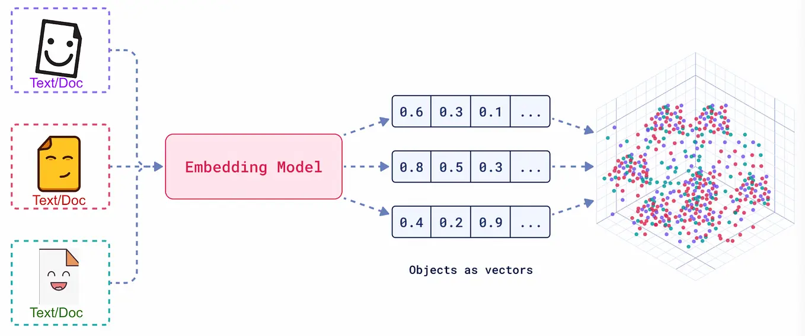

# 第一节 向量嵌入

## 一、向量嵌入基础

### 1.1 基础概念

#### 1.1.1 什么是 Embedding

向量嵌入（Embedding）是一种将真实世界中复杂、高维的数据对象（如文本、图像、音频、视频等）转换为数学上易于处理的、低维、稠密的连续数值向量的技术。

想象一下，我们将每一个词、每一段话、每一张图片都放在一个巨大的多维空间里，并给它一个独一无二的坐标。这个坐标就是一个向量，它“嵌入”了原始数据的所有关键信息。这个过程，就是 Embedding。

- **数据对象**：任何信息，如文本“你好世界”，或一张猫的图片。
- **Embedding 模型**：一个深度学习模型，负责接收数据对象并进行转换。
- **输出向量**：一个固定长度的一维数组，例如 `[0.12, -0.45, 0.88, ...]`。这个向量的维度（长度）通常在几百到几千之间。

 

#### 1.1.2 向量空间的语义表示

Embedding 的真正威力在于，它产生的向量不是随机数值的堆砌，而是对数据**语义**的数学编码。

- **核心原则**：在 Embedding 构建的向量空间中，语义上相似的对象，其对应的向量在空间中的距离会更近；而语义上不相关的对象，它们的向量距离会更远。
- **关键度量**：我们通常使用以下数学方法来衡量向量间的“距离”或“相似度”：
    - **余弦相似度 (Cosine Similarity)**：计算两个向量夹角的余弦值。值越接近 1，代表方向越一致，语义越相似。这是最常用的度量方式。
    - **点积 (Dot Product)**：计算两个向量的乘积和。在向量归一化后，点积等价于余弦相似度。
    - **欧氏距离 (Euclidean Distance)**：计算两个向量在空间中的直线距离。距离越小，语义越相似。

### 1.2 Embedding 在 RAG 中的作用

在RAG流程中，Embedding 扮演着无可替代的重要角色。

#### 1.2.1 语义检索的基础

RAG 的“检索”环节通常以基于 Embedding 的语义搜索为核心。整个流程如下：
1.  **离线索引构建**：将知识库中的所有文档进行切分，然后使用 Embedding 模型将每个文档块（Chunk）转换为向量，存入专门的向量数据库中。
2.  **在线查询检索**：当用户提出问题时，使用**同一个** Embedding 模型将用户的问题也转换为一个向量。
3.  **相似度计算**：在向量数据库中，计算“问题向量”与所有“文档块向量”的相似度。
4.  **召回上下文**：选取相似度最高的 Top-K 个文档块，作为补充的上下文信息，与原始问题一同送给大语言模型（LLM）生成最终答案。

#### 1.2.2 决定检索质量的关键

Embedding 的质量直接决定了 RAG 检索召回内容的准确性与相关性。一个优秀的 Embedding 模型能够精准捕捉问题和文档之间的深层语义联系，即使用户的提问和原文的表述不完全一致。反之，一个劣质的 Embedding 模型可能会因为无法理解语义而召回不相关或错误的信息，从而“污染”提供给 LLM 的上下文，导致最终生成的答案质量低下。

## 二、Embedding 技术发展

Embedding 技术的发展与自然语言处理（NLP）的进步紧密相连，尤其是在 RAG 框架出现后，对嵌入技术提出了新的要求。其演进路径大致可分为以下几个关键阶段。

### 2.1 静态词嵌入：上下文无关的表示

- **代表模型**：Word2Vec (2013), GloVe (2014)
- **主要原理**：为词汇表中的每个单词生成一个固定的、与上下文无关的向量。例如，`Word2Vec` 通过 Skip-gram 和 CBOW 架构，利用局部上下文窗口学习词向量，并验证了向量运算的语义能力（如 `国王 - 男人 + 女人 ≈ 王后`）。`GloVe` 则融合了全局词-词共现矩阵的统计信息。
- **局限性**：无法处理一词多义问题。在“苹果公司发布了新手机”和“我吃了一个苹果”中，“苹果”的词向量是完全相同的，这限制了其在复杂语境下的语义表达能力。

### 2.2 动态上下文嵌入

2017年，`Transformer` 架构的诞生带来了自注意力机制（Self-Attention），它允许模型在生成一个词的向量时，动态地考虑句子中所有其他词的影响。基于此，2018年 `BERT` 模型利用 `Transformer` 的编码器，通过掩码语言模型（MLM）等自监督任务进行预训练，生成了深度上下文相关的嵌入。同一个词在不同语境中会生成不同的向量，这有效解决了静态嵌入的一词多义难题。

### 2.3 RAG 对嵌入技术的新要求

2020年，RAG 框架的提出[^1]，旨在解决大型语言模型**知识固化**（其内部知识难以更新）和**幻觉**（生成的内容可能不符合事实且无法溯源）的问题。RAG 通过“检索-生成”范式，动态地为 LLM 注入外部知识。这一过程的核心是**语义检索**，它完全依赖于高质量的向量嵌入。

RAG 的兴起对嵌入技术提出了更高、更具体的要求：

- **领域自适应能力**：通用的嵌入模型在专业领域（如法律、医疗）可能表现不佳。因此，能够通过微调或使用指令（如 INSTRUCTOR 模型）来适应特定领域术语和语义的嵌入模型变得至关重要。
- **多粒度与多模态支持**：RAG 系统需要处理的不仅仅是短句，还可能包括长文档、代码，甚至是图像和表格。这就要求嵌入模型能够处理不同长度和类型的输入数据。
- **检索效率与混合检索**：嵌入向量的维度和模型大小直接影响存储成本和检索速度。同时，为了结合语义相似性（密集检索）和关键词匹配（稀疏检索）的优点，支持混合检索的嵌入模型（如 BGE-M3）应运而生，成为提升召回率的关键。

## 三、Embedding 模型训练原理

了解了 Embedding 的发展，我们来深入探究一下当前主流的 Embedding 模型（通常是基于 BERT 的变体）是如何通过训练获得强大的语义理解能力的。

### 3.1 核心架构：BERT

现代 Embedding 模型的核心通常是 Transformer 的编码器（Encoder）部分，BERT 就是其中的典型代表。它通过堆叠多个 Transformer Encoder 层来构建一个深度的双向表示学习网络。

### 3.2 核心训练任务

BERT 的成功很大程度上归功于其巧妙的**自监督学习**策略，它允许模型从海量的、无标注的文本数据中学习知识。

#### 任务一：掩码语言模型 (Masked Language Model, MLM)

- **俗称**：“完形填空”。
- **过程**：
    1.  随机地将输入句子中 15% 的词元（Token）替换为一个特殊的 `[MASK]` 标记。
    2.  让模型去预测这些被遮盖住的原始词元是什么。
- **目标**：通过这个任务，模型被迫学习每个词元与其上下文之间的关系，从而掌握深层次的语境语义。

#### 任务二：下一句预测 (Next Sentence Prediction, NSP)

- **俗称**：“判断句子连续性”。
- **过程**：
    1.  构造训练样本，每个样本包含两个句子 A 和 B。
    2.  其中 50% 的样本，B 是 A 的真实下一句（IsNext）；另外 50% 的样本，B 是从语料库中随机抽取的句子（NotNext）。
    3.  让模型判断 B 是否是 A 的下一句。
- **目标**：这个任务让模型学习句子与句子之间的逻辑关系、连贯性和主题相关性。

### 3.3 效果增强策略

虽然 MLM 和 NSP 赋予了模型强大的基础语义理解能力，但为了在检索任务中表现更佳，现代 Embedding 模型通常会引入更具针对性的训练策略。

- **度量学习 (Metric Learning)**：
    - **思想**：直接以“相似度”作为优化目标。
    - **方法**：收集大量相关的文本对（例如，（问题，答案）、（新闻标题，正文）），训练模型使得这些“正例对”的向量余弦相似度尽可能接近 1，而随机组合的“负例对”的相似度尽可能接近 0。

- **对比学习 (Contrastive Learning)**：
    - **思想**：在向量空间中，将相似的样本“拉近”，将不相似的样本“推远”。
    - **方法**：构建一个三元组（Anchor, Positive, Negative）。其中，Anchor 和 Positive 是相关的（例如，同一个问题的两种不同问法），Anchor 和 Negative 是不相关的。训练的目标是让 `distance(Anchor, Positive)` 尽可能小，同时让 `distance(Anchor, Negative)` 尽可能大。

---

## 四、主流中文 Embedding 模型

在选择 Embedding 模型时，了解市面上的主流选择至关重要。

### 4.1 MTEB 排行榜

**MTEB (Massive Text Embedding Benchmark)** 是一个由 Hugging Face 维护的、全面的文本嵌入模型评测基准。它涵盖了分类、聚类、检索、排序等多种任务，并提供了公开的排行榜，是评估和选择 Embedding 模型的重要参考。

### 4.2 主流开源模型：GTE & BGE

在 MTEB 的中文检索任务榜单上，有两个系列的模型长期占据前列，它们都是基于 BERT 架构并采用了前述的增强策略进行训练的。

#### GTE (General Text Embeddings by Alibaba)

- **特点**：由阿里巴巴达摩院推出，是较早成功应用度量学习和对比学习来提升通用文本嵌入能力的模型之一。它通过整合大量高质量的配对数据（如代码与注释、新闻摘要与正文）进行训练，在多个通用文本任务上表现出色。

#### BGE (BAAI General Embedding by BAAI)

- **特点**：由北京智源人工智能研究院（BAAI）推出，是当前中文领域综合性能最强的开源 Embedding 模型系列之一。其最新一代的 **M3 模型** 尤为强大。
- **BGE-M3 模型三大法宝**：
    1.  **多语言/多粒度**：支持超过 100 种语言，并且能处理从短句到长达 8192 个 Token 的长文档，适应性极强。
    2.  **混合检索 (Hybrid Retrieval)**：创新地将不同类型的检索能力集于一身。它输出的向量同时支持：
        - **密集检索 (Dense Retrieval)**：基于语义相似度的检索（常规方式）。
        - **稀疏检索 (Sparse Retrieval)**：类似传统关键词匹配的检索（如 BM25），弥补语义检索在精确匹配上的不足。
        - **多向量检索 (Multi-Vector Retrieval)**：将文本切分为多个更细粒度的向量，能更好地捕捉局部关键信息。
    3.  **功能强大**：凭借其全面的能力，BGE-M3 在 MTEB 榜单上名列前茅，是目前构建高性能中文 RAG 应用的理想选择之一。

---

## 五、Embedding 模型选型指南

理论和模型都已了解，最后我们来解决最实际的问题：如何选择最适合你的项目的 Embedding 模型？

### 5.1 选型流程

MTEB 是一个绝佳的起点，它可以帮助我们快速筛选掉大量不合适的模型。但需要注意，榜单上的得分是在通用数据集上评测的，可能无法完全反映模型在你特定业务场景下的表现。

### 5.2 关键评估维度

在查看榜单时，除了分数，你还需要关注以下几个关键维度：

1.  **任务 (Task)**：对于 RAG 应用，请重点关注 `Retrieval` (检索) 任务下的排名。
2.  **语言 (Language)**：模型是否支持你的业务数据所使用的语言？对于中文 RAG，应选择明确支持中文或多语言的模型。
3.  **模型大小 (Size)**：模型越大，通常性能越好，但对硬件（显存）的要求也越高，推理速度也越慢。需要根据你的部署环境和性能要求来权衡。
4.  **维度 (Dimensions)**：向量维度越高，能编码的信息越丰富，但也会占用更多的存储空间和计算资源。通常 `512` 到 `1024` 维是一个比较均衡的选择。
5.  **最大 Token 数 (Max Tokens)**：这决定了模型能处理的文本长度上限。这个参数是你设计文本分块（Chunking）策略时必须考虑的重要依据，块大小不应超过此限制。
6.  **得分与机构 (Score & Publisher)**：结合模型的得分排名和其发布机构的声誉进行初步筛选。知名机构发布的模型通常质量更有保障。

### 5.3 迭代测试与优化

**最佳实践是，永远不要只依赖公开榜单做最终决定。**

1.  **确定基线 (Baseline)**：根据上述维度，选择 1-2 个有潜力的模型作为你的初始基准模型（例如，BGE-M3-Base）。
2.  **构建私有评测集**：这是最关键的一步。你需要根据你的真实业务数据，手动创建一批高质量的评测样本，每个样本包含一个典型用户问题和它对应的标准答案（或最相关的文档块）。
3.  **迭代优化**：
    - 使用基线模型在你的私有评测集上运行，评估其召回的准确率和相关性。
    - 如果效果不理想，可以尝试更换模型（例如，从 base 版换成 large 版，或尝试其他模型），或者调整 RAG 流程的其他环节（如文本分块策略）。
    - 通过几轮的对比测试和迭代优化，最终选出在你的特定场景下表现最佳的那个“心仪”模型。

---

[^1]: Lewis, P., et al. (2020). *Retrieval-Augmented Generation for Knowledge-Intensive NLP Tasks*. Advances in Neural Information Processing Systems.

## 参考文献

[^1]: [Lewis et al. (2020). *Retrieval-Augmented Generation for Knowledge-Intensive NLP Tasks*. NeurIPS.](https://arxiv.org/abs/2005.11401)
