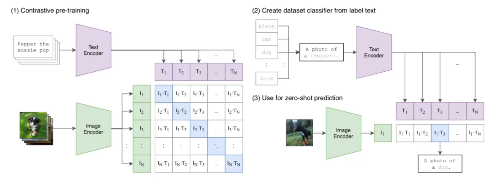

# 第二节 多模态嵌入

现代 AI 的一项重要突破，是将简单的词向量发展成了能统一理解图文、音视频的复杂系统。这一发展建立在**注意力机制、Transformer 架构和对比学习**等关键技术之上，它们解决了在共享向量空间中对齐不同数据模态的核心挑战。其发展环环相扣：Word2Vec 为 BERT 的上下文理解铺路，而 BERT 又为 CLIP 等模型的跨模态能力奠定了基础。

## 一、为什么需要多模态嵌入？

前面的章节介绍了如何为文本创建向量嵌入。然而，仅有文本的世界是不完整的。现实世界的信息是多模态的，包含图像、音频、视频等。传统的文本嵌入无法理解“那张有红色汽车的图片”这样的查询，因为文本向量和图像向量处于相互隔离的空间，存在一堵“模态墙”。

**多模态嵌入 (Multimodal Embedding)** 的目标正是为了打破这堵墙。其目的是将不同类型的数据（如图像和文本）映射到**同一个共享的向量空间**。在这个统一的空间里，一段描述“一只奔跑的狗”的文字，其向量会非常接近一张真实小狗奔跑的图片向量。

实现这一目标的关键，在于解决 **跨模态对齐 (Cross-modal Alignment)** 的挑战。以对比学习、视觉 Transformer (ViT) 等技术为代表的突破，让模型能够学习到不同模态数据之间的语义关联，最终催生了像 CLIP 这样的模型。

## 二、CLIP 模型浅析

在图文多模态领域，OpenAI 的 **CLIP (Contrastive Language-Image Pre-training)** 是一个很有影响力的模型，它为多模态嵌入定义了一个有效的范式。

CLIP 的架构清晰简洁。它采用**双编码器架构 (Dual-Encoder Architecture)**，包含一个图像编码器和一个文本编码器，分别将图像和文本映射到同一个共享的向量空间中。


*图：CLIP 的工作流程。(1) 通过对比学习训练双编码器，对齐图文向量空间。(2)和(3) 展示了如何利用该空间，通过图文相似度匹配实现零样本预测。*

为了让这两个编码器学会“对齐”不同模态的语义，CLIP 在训练时采用了**对比学习 (Contrastive Learning)** 策略。在处理一批图文数据时，模型的目标是：最大化正确图文对的向量相似度，同时最小化所有错误配对的相似度。通过这种“拉近正例，推远负例”的方式，模型从海量数据中学会了将语义相关的图像和文本在向量空间中拉近。

这种大规模的对比学习赋予了 CLIP 有效的**零样本（Zero-shot）识别能力**。它能将一个传统的分类任务，转化为一个“图文检索”问题——例如，要判断一张图片是不是猫，只需计算图片向量与“a photo of a cat”文本向量的相似度即可。这使得 CLIP 无需针对特定任务进行微调，就能实现对视觉概念的泛化理解。

## 三、常用多模态嵌入模型(以bge-visualized-m3为例)

虽然 CLIP 为图文预训练提供了重要基础，但多模态领域的研究迅速发展，涌现了许多针对不同目标和场景进行优化的模型。例如，BLIP 系列专注于提升细粒度的图文理解与生成能力，而 ALIGN 则证明了利用海量噪声数据进行大规模训练的有效性。

在众多优秀的模型中，由北京智源人工智能研究院（BAAI）开发的 **BGE-M3** 是一个很有代表性的现代多模态嵌入模型。它在多语言、多功能和多粒度处理上都表现出色，体现了当前技术向“更统一、更全面”发展的趋势。

BGE-M3 的核心特性可以概括为“M3”：
- **多语言性 (Multi-Linguality)**：原生支持超过 100 种语言的文本与图像处理，能够轻松实现跨语言的图文检索。
- **多功能性 (Multi-Functionality)**：在单一模型内同时支持密集检索（Dense Retrieval）、多向量检索（Multi-Vector Retrieval）和稀疏检索（Sparse Retrieval），为不同应用场景提供了灵活的检索策略。
- **多粒度性 (Multi-Granularity)**：能够有效处理从短句到长达 8192 个 token 的长文档，覆盖了更广泛的应用需求。

在技术架构上，BGE-M3 采用了基于 XLM-RoBERTa 优化的联合编码器，并对视觉处理机制进行了创新。它不同于 CLIP 对整张图进行编码的方式，而是采用**网格嵌入 (Grid-Based Embeddings)**，将图像分割为多个网格单元并独立编码。这种设计显著提升了模型对图像局部细节的捕捉能力，在处理多物体重叠等复杂场景时更具优势。

## 四、代码示例

### 4.1 环境准备

**步骤1：安装 visual_bge 模块**

```bash
# 进入 visual_bge 目录
cd code/C3/visual_bge

# 安装 visual_bge 模块及其依赖
pip install -e .

# 返回上级目录
cd ..
```

**步骤2：下载模型权重**

```bash
# 运行模型下载脚本
python download_model.py
```

模型下载脚本会自动检查 `../../models/bge/` 目录下是否存在模型文件，如果不存在则从 Hugging Face 镜像站下载。

### 4.2 基础示例

```python
import os
os.environ["HF_ENDPOINT"] = "https://hf-mirror.com"
import torch
from visual_bge.visual_bge.visual_bge.modeling import Visualized_BGE

model = Visualized_BGE(model_name_bge="BAAI/bge-base-en-v1.5",
                      model_weight="../../models/bge/Visualized_base_en_v1.5.pth")
model.eval()

with torch.no_grad():
    text_emb = model.encode(text="datawhale开源组织的logo")
    img_emb_1 = model.encode(image="../../data/C3/imgs/datawhale01.png")
    multi_emb_1 = model.encode(image="../../data/C3/imgs/datawhale01.png", text="datawhale开源组织的logo")
    img_emb_2 = model.encode(image="../../data/C3/imgs/datawhale02.png")
    multi_emb_2 = model.encode(image="../../data/C3/imgs/datawhale02.png", text="datawhale开源组织的logo")

# 计算相似度
sim_1 = img_emb_1 @ img_emb_2.T
sim_2 = img_emb_1 @ multi_emb_1.T
sim_3 = text_emb @ multi_emb_1.T
sim_4 = multi_emb_1 @ multi_emb_2.T

print("=== 相似度计算结果 ===")
print(f"纯图像 vs 纯图像: {sim_1}")
print(f"图文结合1 vs 纯图像: {sim_2}")
print(f"图文结合1 vs 纯文本: {sim_3}")
print(f"图文结合1 vs 图文结合2: {sim_4}")
```

**代码解读：**

- **模型架构**: `Visualized_BGE` 是通过将图像token嵌入集成到BGE文本嵌入框架中构建的通用多模态嵌入模型，具备处理超越纯文本的多模态数据的灵活性。
- **模型参数**:
  - `model_name_bge`: 指定底层BGE文本嵌入模型，继承其强大的文本表示能力。
  - `model_weight`: Visual BGE的预训练权重文件，包含视觉编码器参数。
- **多模态编码能力**: Visual BGE提供了编码多模态数据的多样性，支持纯文本、纯图像或图文组合的格式：
  - **纯文本编码**: 保持原始BGE模型的强大文本嵌入能力。
  - **纯图像编码**: 使用基于EVA-CLIP的视觉编码器处理图像。
  - **图文联合编码**: 将图像和文本特征融合到统一的向量空间。
- **应用场景**: 主要用于混合模态检索任务，包括多模态知识检索、组合图像检索、多模态查询的知识检索等。
- **相似度计算**: 使用矩阵乘法计算余弦相似度，所有嵌入向量都被标准化到单位长度，确保相似度值在合理范围内。

**运行结果：**

```bash
=== 相似度计算结果 ===
纯图像 vs 纯图像: tensor([[0.8318]])
图文结合1 vs 纯图像: tensor([[0.8291]])
图文结合1 vs 纯文本: tensor([[0.7627]])
图文结合1 vs 图文结合2: tensor([[0.9058]])
```

> [完整代码](https://github.com/FutureUnreal/all-in-rag/blob/main/code/C3/01_bge_visualized.py)

## 练习

尝试把代码中的部分文本替换一下，比如将`datawhale开源组织的logo`替换为`蓝鲸`看看结果有什么不同。