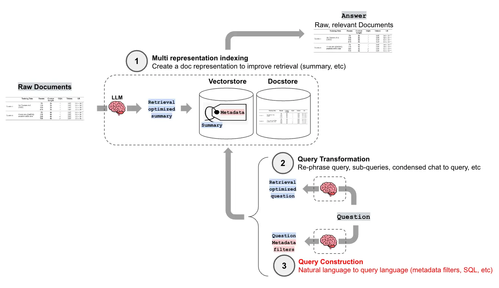

# 第二节：查询构建

在前面的章节中，我们探讨了如何通过向量嵌入和相似度搜索来从非结构化数据中检索信息。然而，在实际应用中，我们常常需要处理更加复杂和多样化的数据，包括结构化数据（如SQL数据库）、半结构化数据（如带有元数据的文档）以及图数据。用户的查询也可能不仅仅是简单的语义匹配，而是包含复杂的过滤条件、聚合操作或关系查询。

**查询构建（Query Construction）**[^1] 正是应对这一挑战的关键技术。它利用大语言模型（LLM）的强大理解能力，将用户的自然语言查询“翻译”成针对特定数据源的结构化查询语言或带有过滤条件的请求。这使得RAG系统能够无缝地连接和利用各种类型的数据，从而极大地扩展了其应用场景和能力。

下图展示了查询构建在一个高级RAG流程中所处的位置：



## 一、文本到元数据过滤器

在构建向量索引时，我们常常会为文档块（Chunks）附加元数据（Metadata），例如文档来源、发布日期、作者、章节、类别等。这些元数据为我们提供了在语义搜索之外进行精确过滤的可能。

**自查询检索器（Self-Query Retriever）** 是LangChain中实现这一功能的核心组件。它的工作流程如下：

1.  **定义元数据结构**：首先，需要向LLM清晰地描述文档内容和每个元数据字段的含义及类型。
2.  **查询解析**：当用户输入一个自然语言查询时，自查询检索器会调用LLM，将查询分解为两部分：
    *   **查询字符串（Query String）**：用于进行语义搜索的部分。
    *   **元数据过滤器（Metadata Filter）**：从查询中提取出的结构化过滤条件。
3.  **执行查询**：检索器将解析出的查询字符串和元数据过滤器发送给向量数据库，执行一次同时包含语义搜索和元数据过滤的查询。

例如，对于查询“关于2022年发布的机器学习的论文”，自查询检索器会将其解析为：
*   **查询字符串**: "机器学习的论文"
*   **元数据过滤器**: `year == 2022`

### 代码示例

接下来以B站视频为例来看看如何使用`SelfQueryRetriever`。

```python
import os
os.environ['HF_ENDPOINT'] = 'https://hf-mirror.com'
from langchain_deepseek import ChatDeepSeek 
from langchain_community.document_loaders import BiliBiliLoader
from langchain.chains.query_constructor.base import AttributeInfo
from langchain.retrievers.self_query.base import SelfQueryRetriever
from langchain_community.vectorstores import Chroma
from langchain_huggingface import HuggingFaceEmbeddings
import logging

logging.basicConfig(level=logging.INFO)

# 1. 初始化视频数据
video_urls = [
    "https://www.bilibili.com/video/BV1Bo4y1A7FU", 
    "https://www.bilibili.com/video/BV1ug4y157xA",
    "https://www.bilibili.com/video/BV1yh411V7ge",
]

bili = []
try:
    loader = BiliBiliLoader(video_urls=video_urls)
    docs = loader.load()
    
    for doc in docs:
        original = doc.metadata
        
        # 提取基本元数据字段
        metadata = {
            'title': original.get('title', '未知标题'),
            'author': original.get('owner', {}).get('name', '未知作者'),
            'source': original.get('bvid', '未知ID'),
            'view_count': original.get('stat', {}).get('view', 0),
            'length': original.get('duration', 0),
        }
        
        doc.metadata = metadata
        bili.append(doc)
        
except Exception as e:
    print(f"加载BiliBili视频失败: {str(e)}")

if not bili:
    print("没有成功加载任何视频，程序退出")
    exit()

# 2. 创建向量存储
embed_model = HuggingFaceEmbeddings(model_name="BAAI/bge-small-zh-v1.5")
vectorstore = Chroma.from_documents(bili, embed_model)
```

在上面的代码中，首先使用 `BiliBiliLoader` 加载了几个B站视频的文档和元数据。需要注意的是，由于 `BiliBiliLoader` 返回的原始元数据结构较为复杂（例如，作者和观看数信息嵌套在其他字典中），所以进行了一些预处理工作：遍历每个文档，手动提取需要的字段（如`title`, `author`, `view_count`, `length`），并构建一个干净、扁平化的新 `metadata` 字典。这个过程确保了后续的自查询检索器能够直接、可靠地访问这些字段。最后，将处理好的文档和元数据存入 `Chroma` 向量数据库中，为下一步的查询构建做好准备。

> 本来是打算使用 FAISS 的，但是 `SelfQueryRetriever` 似乎没有支持 FAISS。

```python
# 3. 配置元数据字段信息
metadata_field_info = [
    AttributeInfo(
        name="title",
        description="视频标题（字符串）",
        type="string", 
    ),
    AttributeInfo(
        name="author",
        description="视频作者（字符串）",
        type="string",
    ),
    AttributeInfo(
        name="view_count",
        description="视频观看次数（整数）",
        type="integer",
    ),
    AttributeInfo(
        name="length",
        description="视频长度，以秒为单位的整数",
        type="integer"
    )
]

# 4. 创建自查询检索器
llm = ChatDeepSeek(
    model="deepseek-chat", 
    temperature=0, 
    api_key=os.getenv("DEEPSEEK_API_KEY")
    )

retriever = SelfQueryRetriever.from_llm(
    llm=llm,
    vectorstore=vectorstore,
    document_contents="记录视频标题、作者、观看次数等信息的视频元数据",
    metadata_field_info=metadata_field_info,
    enable_limit=True,
    verbose=True
)

# 5. 执行查询示例
queries = [
    "时间最短的视频",
    "时长大于600秒的视频"
]

for query in queries:
    print(f"\n--- 查询: '{query}' ---")
    results = retriever.invoke(query)
    if results:
        for doc in results:
            title = doc.metadata.get('title', '未知标题')
            author = doc.metadata.get('author', '未知作者')
            view_count = doc.metadata.get('view_count', '未知')
            length = doc.metadata.get('length', '未知')
            print(f"标题: {title}")
            print(f"作者: {author}")
            print(f"观看次数: {view_count}")
            print(f"时长: {length}秒")
            print("="*50)
    else:
        print("未找到匹配的视频")
```

这部分代码是实现自查询检索的核心。主要分为三个步骤：

1.  **配置元数据字段 (`metadata_field_info`)**：这是与LLM沟通的蓝图。通过 `AttributeInfo` 为每个元数据字段定义名称、类型和一份清晰的自然语言 `description`。LLM 将依赖这份描述来理解如何处理用户的查询，例如，它会根据“视频长度（整数）”的描述来解析关于“时长”的过滤和排序请求。因此，一份准确、无歧义的描述很重要。

2.  **创建自查询检索器 (`SelfQueryRetriever.from_llm`)**：`from_llm` 方法在底层执行了两个核心操作：
    *   **加载查询构造器**：利用传入的 `llm`、`document_contents` 和 `metadata_field_info`，创建一个专门的“查询构造链”。这个链的核心职责是将用户的自然语言查询（如“时长大于600秒的视频”）转换为一个通用的、结构化的查询对象。
    *   **获取内置翻译器**：接着，检查使用的向量数据库（这里是 `Chroma`），并为其匹配一个内置的“翻译器”。这个翻译器负责将上一步生成的通用查询对象，翻译成 `Chroma` 数据库能够原生理解和执行的过滤语法。

3.  **执行查询 (`retriever.invoke`)**：最后，用自然语言发起调用。检索器内部会依次执行“构造”和“翻译”两个步骤，最终向 `Chroma` 发起一个同时包含语义搜索和精确元数据过滤的复合查询，从而返回最相关的结果。

> **提示**：在代码中可以看到 `temperature` 参数被设置为 `0`。这个值是用于控制模型输出的随机性。值越高（如 0.8），输出越随机、越有创意；值越低，输出越确定、越集中。设置为 `0` 可以让模型的输出变得完全确定，即对于相同的输入，总是生成完全相同的输出。在自查询这种需要精确地将自然语言转换为结构化查询的场景下，可以确保转换结果的稳定和可复现。

**输出结果：**

```bash
--- 查询: '时间最短的视频' ---
INFO:httpx:HTTP Request: POST https://api.deepseek.com/v1/chat/completions "HTTP/1.1 200 OK"
INFO:langchain.retrievers.self_query.base:Generated Query: query=' ' filter=None limit=1
标题: 《吴恩达 x OpenAI Prompt课程》【专业翻译，配套代码笔记】02.Prompt 的构建原则
作者: 二次元的Datawhale
观看次数: 18788
时长: 1063秒
==================================================

--- 查询: '时长大于600秒的视频' ---
INFO:httpx:HTTP Request: POST https://api.deepseek.com/v1/chat/completions "HTTP/1.1 200 OK"
INFO:langchain.retrievers.self_query.base:Generated Query: query=' ' filter=Comparison(comparator=<Comparator.GT: 'gt'>, attribute='length', value=600) limit=None
WARNING:chromadb.segment.impl.vector.local_hnsw:Number of requested results 4 is greater than number of elements in index 3, updating n_results = 3
标题: 《吴恩达 x OpenAI Prompt课程》【专业翻译，配套代码笔记】03.Prompt如何迭代优化
作者: 二次元的Datawhale
观看次数: 7090
时长: 806秒
==================================================
标题: 《吴恩达 x OpenAI Prompt课程》【专业翻译，配套代码笔记】02.Prompt 的构建原则
作者: 二次元的Datawhale
观看次数: 18788
时长: 1063秒
```

## 二、文本到Cypher

除了处理扁平化的元数据，查询构建技术还能应用于更复杂的数据结构，如图数据库。

### 2.1 什么是 Cypher？

Cypher 是图数据库（如 Neo4j）中最常用的查询语言，其地位类似于 SQL 之于关系数据库。它采用一种直观的方式来匹配图中的模式和关系，例如 `(:Person {name:"Tomaz"})-[:LIVES_IN]->(:Country {name:"Slovenia"})` 描述了一个人和一个国家以及他们之间的“居住在”关系。

### 2.2 “文本到Cypher”的原理

与“文本到元数据过滤器”类似，“文本到Cypher”技术利用大语言模型（LLM）将用户的自然语言问题直接翻译成一句精准的 Cypher 查询语句。LangChain 提供了相应的工具链（如 `GraphCypherQAChain`），其工作流程通常是：
1.  接收用户的自然语言问题。
2.  LLM 根据预先提供的图谱模式（Schema），将问题转换为 Cypher 查询。
3.  在图数据库上执行该查询，获取精确的结构化数据。
4.  （可选）将查询结果再次交由 LLM，生成通顺的自然语言答案。

由于生成有效的 Cypher 查询是一项复杂的任务，通常使用性能较强的 LLM 来确保转换的准确性。通过这种方式，用户可以用最自然的方式与高度结构化的图数据进行交互，极大地降低了数据查询的门槛。

## 思考

- 为什么本节的代码中查询“时间最短的视频”时，得到的结果是错误的？

## 参考文献

[^1]: [*LangChain Blog: Query Construction*](https://blog.langchain.ac.cn/query-construction/)
