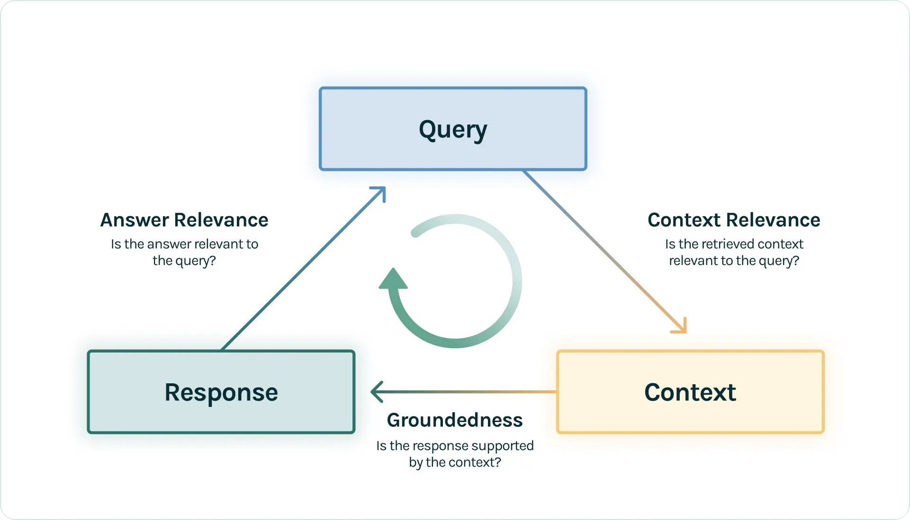

# 第一节：评估介绍

> 构建RAG系统后，下一个关键问题是：如何科学地评估其表现？

评估之所以至关重要，因为它回答了RAG开发与应用中的一系列核心问题：

*   **对于开发者：** 如何量化地追踪、迭代并提升RAG应用的性能？当系统出现“幻觉”或答非所问时，如何快速定位问题根源？
*   **对于用户或决策者：** 面对两个不同的RAG应用，如何客观地评判孰优孰劣？

本节将探讨RAG评估的理念与方法，并围绕 **“RAG三元组（RAG Triad）”** 展开。

## 一、RAG评估三元组

该架构包含以下三个维度，并在 **TruLens** [^1] 等工具中有深入的应用：

1.  **上下文相关性 (Context Relevance)**
    *   **评估目标：** 检索器（Retriever）的性能。
    *   **核心问题：** 检索到的上下文内容，是否与用户的查询（Query）高度相关？
    *   **重要性：** 检索是RAG应用在响应用户查询时的第一步。如果检索回来的上下文充满了噪声或无关信息，那么无论后续的生成模型多么强大，都没法做出正确答案。

2.  **忠实度 / 可信度 (Faithfulness / Groundedness)**
    *   **评估目标：** 生成器的可靠性。
    *   **核心问题：** 生成的答案是否完全基于所提供的上下文信息？
    *   **重要性：** 这个维度主要在于量化LLM的“幻觉”程度。一个高忠实度的回答意味着模型严格遵守了上下文，没有捏造或歪曲事实。如果忠实度得分低，说明LLM在回答时“自由发挥”过度，引入了外部知识或不实信息。

3.  **答案相关性 (Answer Relevance)**
    *   **评估目标：** 系统的端到端（End-to-End）表现。
    *   **核心问题：** 最终生成的答案是否直接、完整且有效地回答了用户的原始问题？
    *   **重要性：** 这是用户最直观的感受。一个答案可能完全基于上下文（高忠实度），但如果它答非所问，或者只回答了问题的一部分，那么这个答案的相关性就很低。例如，当用户问“法国在哪里，首都是哪里？”，如果答案只是“法国在西欧”，那么虽然忠实度高，但答案相关性很低。

> 你可能觉得忠实度和答案相关性很相似，但它们的侧重点不同：忠实度更关注模型是否严格遵循了上下文，而答案相关性则更关注模型是否直接、完整且有效地回答了问题。

通过对这三个维度进行评估，可以对RAG系统的表现有一个全面而细致的了解，并能准确定位问题所在：是检索出了问题，还是生成环节有待改进。

## 二、评估工作流

虽然上面把评估分成了三个部分，但实际上可以把评估过程拆解为两个主要环节：**检索评估**和**响应评估**。

### 2.1 检索评估

检索评估聚焦于RAG三元组中的 **上下文相关性 (Context Relevance)**，本质上是一次**白盒测试**[^2]。此阶段的评估需要一个标注数据集，其中包含一系列查询以及每个查询对应的真实相关文档。

这项评估借鉴了信息检索领域的多个经典指标：

*   **核心评估指标：**
    *   **上下文精确率 (Context Precision):** 衡量检索结果的准确性。计算在检索到的前 **k** 个文档中相关文档所占的比例，其中 **k** 是一个预设的数字（例如，k=3或k=5），代表评估的范围。高精确率意味着检索结果的噪声较少。

        $$ \text{Precision}@k = \frac{\text{检索到的}k\text{个结果中的相关文档数}}{k} $$

    *   **上下文召回率 (Context Recall):** 衡量检索结果的完整性。计算在检索到的前 **k** 个文档中，找到的相关文档占所有真实相关文档总数的比例。高召回率意味着系统能够成功找回大部分关键信息。

        $$ \text{Recall}@k = \frac{\text{检索到的}k\text{个结果中的相关文档数}}{\text{数据集中所有相关的文档总数}} $$

    *   **F1分数 (F1-Score):** F1分数是精确率和召回率的调和平均数，它同时兼顾了这两个指标，在它们之间寻求平衡。当精确率和召回率都高时，F1分数也高。

        $$ F_1 = 2 \cdot \frac{\text{Precision} \times \text{Recall}}{\text{Precision} + \text{Recall}} $$

    *   **平均倒数排名 (MRR - Mean Reciprocal Rank):** 评估系统将第一个相关文档排在靠前位置的能力。对于一个查询，倒数排名是第一个相关文档排名的倒数。MRR是所有查询的倒数排名的平均值。该指标适用于用户通常只关心第一个正确答案的场景。

        $$ \text{MRR} = \frac{1}{|Q|} \sum_{q=1}^{|Q|} \frac{1}{\text{rank}_q} $$

        其中 `|Q|` 是查询总数，`rank_q` 是第 `q` 个查询的第一个相关文档的排名。
    *   **平均准确率均值 (MAP - Mean Average Precision):** MAP是一个综合性指标，同时评估了检索结果的精确率和相关文档的排名。它先计算每个查询的平均精确率（AP），然后对所有查询的AP取平均值。AP本身是基于每个相关文档被检索到时的精确率计算的。
    
        $$\text{MAP} = \frac{1}{|Q|} \sum_{q=1}^{|Q|} \text{AP}(q)$$

        其中 `|Q|` 是查询总数，`AP(q)` 是第 `q` 个查询的平均精确率（Average Precision）。

要计算上述所有指标，前提是拥有一个高质量的标注数据集，其中包含了查询和每个查询对应的“真实”相关文档。

### 2.2 响应评估

响应评估覆盖了RAG三元组中的 **忠实度** 和 **答案相关性**。此环节通常采用 **端到端** 的评估范式，因为它直接衡量用户感知的最终输出质量。无论采用何种评估方法，都主要围绕以下两个核心维度展开。

#### 2.2.1 评估维度

1.  **忠实度 / 可信度:**
    *  衡量生成的答案在多大程度上可以由给定的上下文所证实。一个完全忠实的答案，其所有内容都必须能在上下文中找到依据，以此避免模型产生“幻觉”。

2.  **答案相关性:**
    *  衡量生成的答案与用户原始查询的对齐程度。一个高相关性的答案必须是直接的、切题的，并且不包含与问题无关的冗余信息。

#### 2.2.2 主要评估方法

针对上述维度，目前主要有两类评估方法：

**1. 基于大语言模型的评估**

这是一种强大的评估方法，能够提供更深度的语义评估，正逐渐成为主流选择。利用一个高性能、中立的llm作为“评估者”，对上述维度进行深度的语义理解和打分。

*   **忠实度评估：** 首先，将生成的答案分解为一系列独立的声明或断言（Claims）。然后，对于每一个断言，在提供的上下文中进行验证，判断其真伪。最终的忠实度分数是所有被上下文证实的断言所占的比例。
*   **答案相关性评估：** 评估者需要同时分析用户查询和生成的答案。评分时会惩罚那些答非所问、信息不完整或包含过多无关细节的答案。

**2. 基于词汇重叠的经典指标**

这类指标需要在数据集中包含一个或多个“标准答案”。它们通过计算生成答案与标准答案之间 n-gram（连续的n个词）的重叠程度来评估质量。

*   **ROUGE (Recall-Oriented Understudy for Gisting Evaluation):** ROUGE关注的重点是 **召回率**，即标准答案中的词语有多少被生成答案所覆盖，因此常用于评估内容的 **完整性**。其常用变体包括计算n-gram的 `ROUGE-N` 和计算最长公共子序列的 `ROUGE-L`。

    $$\text{ROUGE-N} = \frac{\text{匹配的 }n\text{-gram 数量}}{\text{参考答案中 }n\text{-gram 的总数}}$$

*   **BLEU (Bilingual Evaluation Understudy):** BLEU侧重于评估 **精确率**，衡量生成的答案中有多少词是有效的（即在标准答案中出现过）。它还引入了长度惩罚机制，避免模型生成过短的句子，因此更适合评估答案的 **流畅度和准确性**。

    $$\text{BLEU} = \text{BP} \times \exp\left(\sum_{n=1}^{N} w_n \log p_n\right)$$

    其中，`BP` 是长度惩罚因子，`p_n` 是修正后的n-gram精确率。

*   **METEOR (Metric for Evaluation of Translation with Explicit ORdering):** 作为BLEU的改进版，METEOR同时考量 **精确率和召回率** 的调和平均，并通过词干和同义词匹配（如将'boat'和'ship'视为相关）来更好地捕捉语义相似性。其评估结果通常被认为与人类判断的相关性更高。

    $$F_{\text{mean}} = \frac{P \times R}{\alpha P + (1-\alpha)R}$$

    $$\text{METEOR} = F_{\text{mean}} \times (1 - \text{Penalty})$$

    其中 `P` 是精确率，`R` 是召回率，`Penalty` 是基于语序的惩罚项。

> **示例说明**
> 
> 为了更直观地理解三者的区别，来看一个简单的例子。
> 
> **假设：**
> *   **参考答案：** `狗 在 床 上面` (共5个词)
> *   **生成答案：** `狗 在 床 上` (共4个词)
> 
> **评估分析：**
> *   **ROUGE (召回率导向):** 从召回率的角度出发：“参考答案里的5个词，生成答案覆盖了多少？”——覆盖了4个。因此，它的召回率很高（ROUGE-1 为 4/5），得分会不错。ROUGE更关心“说全了没”。
> 
> *   **BLEU (精确率导向):** 从精确率的角度进行评判：“生成答案里的4个词，有多少是有效的（在参考答案里）？”——全部有效，精确率很高。但它会发现生成答案比参考答案短，于是通过 **长度惩罚(Brevity Penalty)** 进行扣分。BLEU更关心“说对了没，以及长度是否合适”。
> 
> *   **METEOR (综合平衡):** 同时计算精确率和召回率，并取一个调和平均。在这个例子里，词序是完全正确的，惩罚项为0。METEOR会在“说全”和“说对”之间找到一个最佳平衡点。

#### 2.2.3 方法对比和总结

基于LLM的评估更注重**语义和逻辑**，评估质量高，但成本也更高且存在评估者偏见。基于词汇重叠的指标**客观、计算快、成本低**，但无法理解语义，可能误判同义词或释义。在实践中，可以将两者结合，使用经典指标进行快速、大规模的初步筛选，再利用LLM进行更精细的评估。

## 参考文献

[^1]: [*The RAG Triad of Metrics*](https://www.trulens.org/getting_started/core_concepts/rag_triad/).

[^2]：[*如何评估 RAG 应用？*](https://zilliz.com.cn/blog/how-to-evaluate-rag-zilliz)
