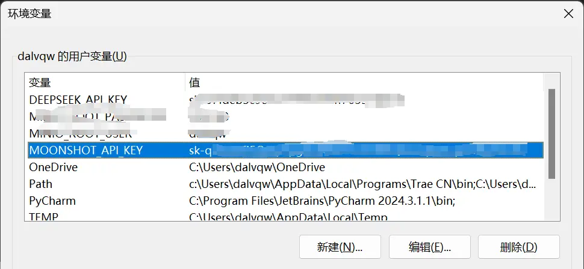

# 第一节 环境配置与项目架构

> 经过前面十几天的鏖战也是终于来到了项目实战环节。接下来，通过一个完整的实战项目来把前面学到的知识串联起来，构建一个真正可用的RAG系统。

## 一、项目背景

这个项目的灵感来自于笔者前段时间刷视频时，偶然刷到了一个有趣的开源项目介绍——[程序员做饭指南](https://github.com/Anduin2017/HowToCook)。这是一个菜谱项目，用Markdown格式记录了各种菜品的制作方法，从简单的家常菜到复杂的宴客菜，应有尽有。更完美的是，这个项目中每道菜的Markdown文件都严格使用统一的小标题。

看到这个项目，笔者立刻想到：能不能构建一个智能问答系统来解决我的选择困难症？每天面对"今天吃什么"这个世纪难题，如果有个AI助手能根据我的需求推荐菜品、告诉我怎么做，那该多好！于是就有了搭建这个**尝尝咸淡RAG系统**的想法。

## 二、环境配置

### 2.1 创建虚拟环境

```bash
# 使用conda创建环境
conda create -n cook-rag-1 python=3.12.7
conda activate cook-rag-1
```

### 2.2 安装核心依赖

老规矩，进入本章对应项目目录安装依赖包

```bash
cd code/C8
pip install -r requirements.txt
```

### 2.3 申请Kimi API Key

Kimi2 发布第八天来尝尝咸淡，申请地址：[Kimi API官网](https://platform.moonshot.cn/console/api-keys)。目前注册会送15元的额度，绰绰有余了。

### 2.4 API配置

参考前面章节 [**环境准备**](../chapter1/02_preparation.md) 中关于api_key的配置方法。在windows下，配置完成后应该如下图所示：



## 三、项目架构

### 3.1 项目目标

我们将基于HowToCook项目的菜谱数据，构建一个智能的食谱问答系统。用户可以：

- 询问具体菜品的制作方法："宫保鸡丁怎么做？"
- 寻求菜品推荐："推荐几个简单的素菜"
- 获取食材信息："红烧肉需要什么食材？"

### 3.2 数据分析

#### 3.2.1 文档分析

HowToCook项目包含了大约300多个Markdown格式的菜谱文件。这些菜谱有两个关键特点：一是结构高度规整，每个文件都严格按照统一的格式来组织内容；二是内容篇幅较短，单个菜谱通常在700字左右。

打开任意一个菜谱文件，可以发现它们都遵循着相似的结构模式。通常以菜品做法作为一级标题，开头会有一段简介和难度评级，然后分为"必备原料和工具"、"计算"、"操作"、"附加内容"等几个主要部分。比如西红柿炒鸡蛋这道菜：

```markdown
# 西红柿炒鸡蛋的做法

西红柿炒蛋是中国家常几乎最常见的一道菜肴...
预估烹饪难度：★★

## 必备原料和工具
* 西红柿
* 鸡蛋
* 食用油...

## 计算
每次制作前需要确定计划做几份...
* 西红柿 = 1 个（约 180g） * 份数
* 鸡蛋 = 1.5 个 * 份数，向上取整...

## 操作
- 西红柿洗净
- 可选：去掉西红柿的外表皮...

## 附加内容
这道菜根据不同的口味偏好，存在诸多版本...
```

从数据上来看，这种高度结构化的数据不需要过多处理就可以直接用于RAG系统构建。还记得我们在第2章学过的[**Markdown结构分块**](../chapter2/05_text_chunking.md#34-基于文档结构的分块)吗？这个数据完全契合那种按标题层级分块的思路。更重要的是，每个菜谱文件的内容都不算太长，单个章节的内容通常在几百字左右，这意味着可以直接按照标题进行分块，而不用担心第2章提到的那个问题——某个章节内容过长超出模型上下文窗口，需要与常规分块方法（如`RecursiveCharacterTextSplitter`）组合使用。

#### 3.2.2 结构分块局限

虽然Markdown结构分块看起来很理想，但在实际使用中可能会遇到一个问题：按照标题严格分块会把内容切得太细，导致上下文信息不完整。比如用户问"宫保鸡丁怎么做"，如果严格按标题分块，可能只检索到"操作"这一个章节，但缺少了"必备原料和工具"的信息，LLM就无法给出完整的制作指导。甚至有时候检索到的是"附加内容"中的某个变化做法，没有基础制作步骤，回答就会显得莫名其妙。如果你尝试直接把整个菜谱文档作为一个块，可以发现效果反而比结构分块要好，因为上下文信息是完整的。

为了解决这个矛盾，可以采用父子文本块的策略：用小的子块进行精确检索，但在生成时传递完整的父文档给LLM。这种方法在第3章的索引优化中虽然没有专门介绍，但本质上也属于上下文拓展的一种应用。通过这种方式，我们既保证了检索的精确性，又确保了生成时上下文的完整性。

> 反正都是把整个文档传给LLM，我为什么不直接用整个文档分块呢？

这个问题问得很好！关键在于当用户问"宫保鸡丁需要什么调料"时，如果直接用整个文档做向量检索，这个具体问题在整个文档中的占比很小，很可能检索不到或者排名很靠后。但如果用小块检索，"必备原料和工具"这个章节就能精确匹配用户的需求。

简单来说，这种设计是"小块检索，大块生成"——用小块的精确性找到相关内容，用大块的完整性保证回答质量。如果直接用整个文档分块，就失去了检索的精确性优势。

### 3.3 整体架构

数据处理好之后，剩余的部分就是四个主要流程的组合，每个流程对工具进行筛选和优化后就可以构建出一个简单的rag系统。当前项目的架构如下图所示：

```mermaid
flowchart TD
    %% 系统初始化
    START[🚀 系统启动] --> CONFIG[⚙️ 加载配置<br/>RAGConfig]
    CONFIG --> INIT[🔧 初始化模块]
    
    %% 索引加载/构建
    INIT --> INDEX_CHECK{📂 检查索引缓存}
    INDEX_CHECK -->|存在| LOAD_INDEX[⚡ 加载已保存索引<br/>秒级启动]
    INDEX_CHECK -->|不存在| BUILD_NEW[🔨 构建新索引]
    
    %% 构建新索引的顺序流程
    BUILD_NEW --> DataPrep
    DataPrep --> IndexBuild
    IndexBuild --> SAVE_INDEX[💾 保存索引到配置路径]
    
    %% 加载已有索引也需要数据准备（用于检索模块）
    LOAD_INDEX --> DataPrepForRetrieval[📚 加载文档和分块<br/>用于检索模块]
    DataPrepForRetrieval --> READY[✅ 系统就绪]
    SAVE_INDEX --> READY
    
    %% 用户交互开始
    READY --> A[👤 用户输入问题]
    A --> B{🎯 查询路由}
    
    %% 查询路由分支
    B -->|list| C[📋 推荐查询]
    B -->|detail| D[📖 详细查询] 
    B -->|general| E[ℹ️ 一般查询]
    
    %% 查询重写逻辑 - 合并相同处理
    C --> KEEP[📝 保持原查询]
    D --> KEEP
    E --> REWRITE[🔄 查询重写]
    
    %% 所有查询都进入统一的检索流程
    KEEP --> F[🔍 混合检索<br/>top_k=config.top_k]
    REWRITE --> F
    
    %% 检索阶段
    F --> G[📊 向量检索<br/>config.embedding_model]
    F --> H[🔤 BM25检索<br/>关键词匹配]
    
    %% RRF重排
    G --> I[⚡ RRF重排融合]
    H --> I
    I --> J[📖 检索到子块]
    
    %% 父子文档处理
    J --> K[🧠 智能去重<br/>按相关性排序]
    K --> L[📚 获取父文档]
    
    %% 生成阶段 - 根据路由类型选择不同模式
    L --> M{🎨 生成模式路由}
    M -->|list查询| N[📋 生成菜品列表<br/>简洁输出]
    M -->|detail查询| O[📝 分步指导模式<br/>config.llm_model<br/>详细步骤]
    M -->|general查询| P[💬 基础回答模式<br/>config.temperature<br/>一般信息]
    
    %% 输出结果
    N --> Q[✨ 返回结果]
    O --> Q
    P --> Q
    
    %% 数据准备子流程
    subgraph DataPrep [📚 数据准备模块]
        R[📁 加载Markdown文件<br/>config.data_path] --> S[🔧 元数据增强]
        S --> T[✂️ 按标题分块]
        T --> U[🏷️ 父子关系建立]
        U --> CHUNKS[📦 输出文本块chunks]
    end
    
    %% 索引构建子流程  
    subgraph IndexBuild [🔍 索引构建模块]
        CHUNKS --> V[🤖 BGE嵌入模型<br/>config.embedding_model]
        V --> W[📊 FAISS向量索引]
        W --> X[💾 索引持久化<br/>config.index_save_path]
    end
    
    %% 配置管理子流程
    subgraph ConfigMgmt [⚙️ 配置管理]
        CFG1[🎛️ 默认配置<br/>DEFAULT_CONFIG]
        CFG2[🔧 自定义配置<br/>RAGConfig]
        CFG3[🌐 环境变量<br/>HF_ENDPOINT]
    end
    
    %% 连接配置到各模块
    ConfigMgmt --> DataPrep
    ConfigMgmt --> IndexBuild
    ConfigMgmt --> F
    ConfigMgmt --> O
    ConfigMgmt --> P
    
    %% 样式定义
    classDef startup fill:#e3f2fd,stroke:#0277bd,stroke-width:2px
    classDef config fill:#f1f8e9,stroke:#388e3c,stroke-width:2px
    classDef userInput fill:#e1f5fe,stroke:#01579b,stroke-width:2px
    classDef routing fill:#f3e5f5,stroke:#4a148c,stroke-width:2px
    classDef rewrite fill:#e8eaf6,stroke:#3f51b5,stroke-width:2px
    classDef retrieval fill:#e8f5e8,stroke:#1b5e20,stroke-width:2px
    classDef generation fill:#fff3e0,stroke:#e65100,stroke-width:2px
    classDef output fill:#fce4ec,stroke:#880e4f,stroke-width:2px
    classDef module fill:#f1f8e9,stroke:#33691e,stroke-width:2px
    classDef cache fill:#fff8e1,stroke:#f57c00,stroke-width:2px
    classDef dataflow fill:#e1f5fe,stroke:#0277bd,stroke-width:2px
    
    %% 应用样式
    class START,INIT startup
    class CONFIG,ConfigMgmt,CFG1,CFG2,CFG3 config
    class INDEX_CHECK,LOAD_INDEX,SAVE_INDEX cache
    class A userInput
    class B,C,D,E,M routing
    class KEEP,REWRITE rewrite
    class F,G,H,I,J,K,L retrieval
    class N,O,P generation
    class Q output
    class DataPrep,IndexBuild module
    class BUILD_NEW,READY,DataPrepForRetrieval startup
    class CHUNKS dataflow
```

### 3.4 项目结构

基于上面的架构，可以构建出如下项目结构：

```text
code/C8/
├── config.py                   # 配置管理
├── main.py                     # 主程序入口
├── requirements.txt            # 依赖列表
├── rag_modules/               # 核心模块
│   ├── __init__.py
│   ├── data_preparation.py    # 数据准备模块
│   ├── index_construction.py  # 索引构建模块
│   ├── retrieval_optimization.py # 检索优化模块
│   └── generation_integration.py # 生成集成模块
└── vector_index/              # 向量索引缓存（自动生成）
```

## 小结

本节从项目背景出发，完成了RAG系统的环境配置和整体架构设计。从下一节开始，我们将深入学习各个模块的具体实现，看看如何将这些设计思路转化为可运行的代码。
